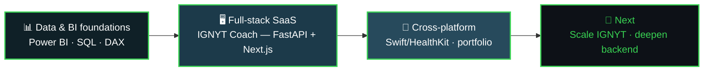

<div align="center">


<br />

I started in mechanical engineering — brake systems for a Formula Student car — before moving
into data analytics and, from there, into building the full software behind the numbers.
That path shows up in how I work: instrument things, look at what the data says, then build
the system that acts on it.

<br />

[](https://varun642002.github.io/varun-portfolio/)
[](https://www.linkedin.com/in/varun64200/)
[](https://github.com/varun642002)

<br />

<picture>
  <source media="(prefers-color-scheme: dark)" srcset="https://raw.githubusercontent.com/varun642002/varun642002/output/snake-dark.svg" />
  <source media="(prefers-color-scheme: light)" srcset="https://raw.githubusercontent.com/varun642002/varun642002/output/snake.svg" />
  
</picture>

</div>


```text
┌──────────────────────────────────────────────────────────────────┐
│  VARUN.TELEMETRY                                                  │
│  ────────────────────────────────────────────────────────────    │
│  SIGNAL       brake-systems engineer → data analyst → builder     │
│  BUILDING     IGNYT Coach — trainer/gym SaaS (FastAPI + Next.js)  │
│  ANALYZING    e-commerce, HR & public-health datasets in Power BI │
│  STATUS       ● ONLINE — shipping across web, iOS and BI          │
└──────────────────────────────────────────────────────────────────┘
```


## What I Build

<table>
<tr>
<td width="25%" align="center">


**Full-stack products**

End-to-end apps with a real backend, a real database, and a UI people actually use — not just prototypes.

</td>
<td width="25%" align="center">


**Data analytics & BI**

Dashboards that turn raw datasets — sales, HR, public health — into decisions, with SQL, DAX and Power BI.

</td>
<td width="25%" align="center">


**AI-assisted analytics**

Workspaces that automate the repetitive parts of data work — profiling, cleaning, EDA — so analysis starts faster.

</td>
<td width="25%" align="center">


**Cross-platform delivery**

The same product as a web dashboard, a native mobile app, and the CI pipeline that ships it.

</td>
</tr>
</table>


## Featured Projects

<table>
<tr>
<td colspan="3">

</td>
</tr>
<tr>
<td width="8%" align="center"></td>
<td width="52%">

**[IGNYT Coach](https://github.com/varun642002/ignyt-coach)**
Trainer/gym management SaaS — owners, trainers and assistants manage clients, build
training programmes and meal plans, run check-ins, message clients, and bill them,
with assigned work syncing straight into the IGNYT client app.

*Why it matters:* independent trainers and small gyms run their business across
spreadsheets, group chats and payment apps. This puts programming, billing and
communication in one system with real role separation between owner/trainer/assistant.

</td>
<td width="40%">


`Python` `FastAPI` `PostgreSQL`
`Next.js 15` `TypeScript` `Docker`

[**📦 Repo**](https://github.com/varun642002/ignyt-coach)

<sub>Live demo is currently offline between deploys — repo has the full architecture.</sub>

</td>
</tr>
<tr><td colspan="3"><br/></td></tr>
<tr>
<td colspan="3">

</td>
</tr>
<tr>
<td align="center"></td>
<td>

**[Ai-Data-Analytics-workspace](https://github.com/varun642002/Ai-Data-Analytics-workspace)**
An analytics workspace for data profiling, cleaning, exploratory analysis, SQL querying,
visualization and dashboards — with AI assisting the interpretation layer on top.

*Why it matters:* most analysis time goes into cleaning and profiling before any real
insight happens. This collapses that setup work into one workspace instead of a chain
of notebooks and scripts.

</td>
<td>


`TypeScript` `Python` `SQL`

[**📦 Repo**](https://github.com/varun642002/Ai-Data-Analytics-workspace)

<sub>Live demo is currently offline between deploys — repo has the full source.</sub>

</td>
</tr>
<tr><td colspan="3"><br/></td></tr>
<tr>
<td colspan="3">

</td>
</tr>
<tr>
<td align="center"></td>
<td>

**[IGNYT](https://github.com/varun642002/IGNYTfit.in)**
The consumer side of IGNYT — a fitness & nutrition tracker (Next.js web app) paired with a native **[iOS build](https://github.com/varun642002/Ignyt-ios)**
(Swift, HealthKit integration, Codemagic CI) that mirrors programmes assigned by a coach.

*Why it matters:* a trainer's plan is only useful if the client can actually follow it
from their phone, with health data feeding back into the loop.

</td>
<td>


`Next.js` `TypeScript` `Swift` `HealthKit`

[**🔗 Live**](https://ignytfit.in) · [**📦 Web**](https://github.com/varun642002/IGNYTfit.in) · [**📦 iOS**](https://github.com/varun642002/Ignyt-ios)

</td>
</tr>
<tr><td colspan="3"><br/></td></tr>
<tr>
<td colspan="3">

</td>
</tr>
<tr>
<td align="center"></td>
<td>

**[Olist E-Commerce Sales Analysis](https://github.com/varun642002/Olist-Ecommerce-Sales-Analysis-powerbi)**
Executive, Sales and Customer Insights dashboards built on the Olist Brazilian
e-commerce dataset.

*Why it matters:* demonstrates the full BI loop — modeling raw transactional data
into a schema, writing DAX measures, and presenting it for execs, sales and customer ops.

</td>
<td>


`Power BI` `SQL` `DAX` `Excel`

[**📦 Repo**](https://github.com/varun642002/Olist-Ecommerce-Sales-Analysis-powerbi)

</td>
</tr>
<tr><td colspan="3"><br/></td></tr>
<tr>
<td colspan="3">

</td>
</tr>
<tr>
<td align="center"></td>
<td>

**[HR Workforce Analytics Dashboard](https://github.com/varun642002/Hr-workforce-analytics-dashboard)**
Power BI dashboard analyzing employee demographics, workforce distribution,
attrition trends and satisfaction.

*Why it matters:* attrition is expensive and usually invisible until it's a crisis —
this surfaces the trend early enough for HR to act on it.

</td>
<td>


`Power BI` `SQL` `DAX` `Power Query`

[**📦 Repo**](https://github.com/varun642002/Hr-workforce-analytics-dashboard)

</td>
</tr>
</table>


## Tech Stack

<div align="center">

**Core stack**


**Data & BI**


</div>


## Development Journey



I started with BI dashboards to get comfortable turning raw data into a decision.
From there I moved into building the systems that produce that data in the first
place — which is where IGNYT Coach came from. The iOS build and this portfolio are
the most recent step: making the same product work as a native app, and getting
better at presenting the work itself.


## Currently Building

```text
🔨 Currently Building
├── IGNYT Coach     — trainer/gym SaaS: billing, chat and programme sync
├── IGNYT iOS       — Swift + HealthKit client, wired to Codemagic CI
└── This portfolio  — a "telemetry" themed site, instrument-dial signature interaction
```


## Engineering Philosophy

| | |
|:---:|---|
| ⚙️ | **Build for a real user, not a resume line.** IGNYT Coach exists because trainers actually run their business across five disconnected tools — that's the problem, not "learn FastAPI." |
| 📈 | **Instrument before you optimize.** Coming from BI, I default to looking at the actual data/behavior before guessing at a fix. |
| 🧩 | **Keep the pieces separable.** IGNYT Coach and the IGNYT consumer app are two repos with one HTTP contract between them, on purpose — each can change without breaking the other. |
| 🚀 | **Ship the whole path.** A dashboard, a backend, a mobile client, and the CI that deploys it — the project isn't done until the last mile works too. |


## GitHub Activity

<div align="center">

<picture>
  <source media="(prefers-color-scheme: dark)" srcset="https://github-readme-streak-stats.herokuapp.com/?user=varun642002&hide_border=true&background=0D1117&ring=39D353&fire=39D353&currStreakLabel=39D353" />
  
</picture>

<sub>Full contribution graph is on the profile page itself, right below this README.</sub>

</div>


<div align="center">

## Connect

[](https://varun642002.github.io/varun-portfolio/)
[](https://www.linkedin.com/in/varun64200/)
[](https://github.com/varun642002)

<sub>Profile views: </sub>


</div>
